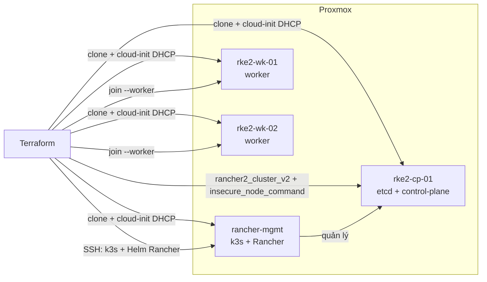

# Terraform lab: Rancher + RKE2 trên Proxmox

Lab **đã triển khai**: 4 VM Ubuntu 24.04 trên Proxmox (cloud-init DHCP, ghim MAC), Rancher trên k3s single-node, cluster custom RKE2 (1 control-plane + 2 workers) do Rancher quản lý.

Hướng dẫn chạy / destroy: [`README.md`](README.md). Việc còn lại nằm ở mục **TODO** trong README.

## Trạng thái

| Thành phần | Hiện trạng |
| --- | --- |
| Template Ubuntu 24.04 (`VMID` 9000) | Có `qemu-guest-agent`, xóa `machine-id`, `dhcp-identifier: mac` |
| 4 VM (`rancher-mgmt`, `rke2-cp-01`, `rke2-wk-01/02`) | Clone full, DHCP, MAC ghim trong `terraform.tfvars` |
| Rancher | Helm `rancher-latest` trên k3s (Traefik), `replicas=1`, hostname sslip.io |
| Cluster `lab-rke2` | `rancher2_cluster_v2` custom; join bằng `insecure_node_command` |
| State | Có output URL / IP / kubeconfig sau khi cluster Connected |

IPv4 lấy từ qemu-guest-agent sau DHCP — không gán static trong Terraform (netplan bake `99-dhcp-mac.yaml` ghi đè ipconfig static của Proxmox).

## Đã làm

- [x] [`scripts/create-ubuntu-24.04-template.sh`](scripts/create-ubuntu-24.04-template.sh) — cloud image, bake guest-agent bằng one-shot cloud-init (không `virt-customize` / libguestfs: conflict `pve-qemu-kvm`)
- [x] [`scripts/destroy-clones-from-template.sh`](scripts/destroy-clones-from-template.sh) — xóa clone trên node Proxmox, giữ template
- [x] Module `proxmox_vm`: `proxmox_virtual_environment_vm` clone + cloud-init DHCP + agent + MAC
- [x] Root Terraform: 4 VM, k3s + Helm Rancher, `rancher2_bootstrap`, `rancher2_cluster_v2`, SSH join CP/workers
- [x] Ghim MAC; lọc IPv4 guest-agent (bỏ loopback / CNI `10.42`/`10.43`)
- [x] Workaround DNS sslip.io RFC1918 (`/etc/hosts` + CoreDNS `HelmChartConfig` trên CP)
- [x] Workaround Rancher 2.15: cluster `local` không set condition `Updated` → script giữ condition cho `rancher2_bootstrap`
- [x] README, `terraform.tfvars.example`, `.gitignore`

## Kiến trúc

Downstream **không** tự cài RKE2. Rancher tạo cluster custom; Terraform SSH vào từng node, chạy `insecure_node_command` (`--etcd --controlplane` / `--worker`) vì cert Rancher tự ký.

Sizing mặc định ~20 GB RAM: mgmt 4 vCPU / 8 GB / 40 GB; mỗi node RKE2 2 vCPU / 4 GB / 40 GB. `worker_count` là variable.

## Providers

- [`bpg/proxmox` `= 0.111.1`](https://registry.terraform.io/providers/bpg/proxmox/0.111.1/docs) — pin cứng. Resource `proxmox_virtual_environment_vm` (clone + `initialization` + `agent`), không dùng `proxmox_virtual_environment_cloned_vm` (không quản lý cloud-init / guest-agent).
- [`rancher/rancher2` `~> 14.1`](https://registry.terraform.io/providers/rancher/rancher2/latest/docs) — alias `bootstrap` rồi `admin`. Timeout provider `15m` (mặc định 120s không đủ). Auth Proxmox qua env (`PROXMOX_VE_ENDPOINT`, `PROXMOX_VE_API_TOKEN`); lab không cần SSH vào host vì không dùng Snippets.

## Luồng Terraform

1. Clone 4 VM từ template; cloud-init native (user `ubuntu`, SSH key, DHCP `vmbr0`). Ghim MAC nếu muốn reservation DHCP ngoài Terraform.
2. Chờ qemu-guest-agent trả IPv4 (bỏ `127.0.0.1`, link-local, CNI).
3. SSH `rancher-mgmt`: cài k3s pin version (giữ Traefik, `INSTALL_K3S_SKIP_START` rồi start qua systemd để không cắt remote-exec), Helm, cert-manager, chart Rancher `hostname=rancher.<ip>.sslip.io`, `replicas=1`.
4. Healthcheck `/ping` bằng `--resolve` (không phụ thuộc DNS công cộng trên guest). Chờ cluster `local` Connected + `rancher-webhook`, rồi giữ condition `Updated=True`.
5. `rancher2_bootstrap` → token admin.
6. `rancher2_cluster_v2` (`kubernetes_version` = variable, phải có trong UI Rancher).
7. SSH 3 node RKE2: `insecure_node_command` + `CATTLE_AGENT_STRICT_VERIFY=false`. Control-plane ghi thêm CoreDNS `hosts` cho hostname Rancher.

`rancher2` cần URL sau khi biết IPv4 DHCP → apply lần đầu thường 2 bước (target module VM, rồi apply full). Xem README.

## Cấu trúc repo

- [`scripts/create-ubuntu-24.04-template.sh`](scripts/create-ubuntu-24.04-template.sh) — chạy **trên node Proxmox**, một lần (TF không tạo template).
- [`scripts/destroy-clones-from-template.sh`](scripts/destroy-clones-from-template.sh) — dọn clone trên PVE khi state/VM lệch.
- [`scripts/install-k3s-rancher.sh`](scripts/install-k3s-rancher.sh) / [`scripts/join-rke2-node.sh`](scripts/join-rke2-node.sh) — remote-exec, idempotent.
- [`modules/proxmox_vm`](modules/proxmox_vm) — clone, CPU/RAM/disk, agent, cloud-init, tags, MAC.
- Root: [`versions.tf`](versions.tf), [`providers.tf`](providers.tf), [`variables.tf`](variables.tf), [`locals.tf`](locals.tf), [`vms.tf`](vms.tf), [`rancher.tf`](rancher.tf), [`cluster.tf`](cluster.tf), [`outputs.tf`](outputs.tf), [`terraform.tfvars.example`](terraform.tfvars.example).

Variables chính (trong `terraform.tfvars`, gitignored): `proxmox_node`, `template_id`, `datastore_id`, `bridge`, SSH paths, `rancher_bootstrap_password`, `k3s_version`, `rke2_kubernetes_version`, MAC, sizing.

Outputs: `rancher_url`, IP + MAC 4 VM, `cluster_name` / `cluster_id`, `rke2_kube_config` (sensitive; có khi cluster Connected).

## Điểm đã vướng (đã xử lý trong code)

- Template thiếu guest-agent → TF không lấy IP.
- `machine-id` bake sẵn → mọi clone cùng DUID DHCP / cùng IPv4.
- sslip.io + DNS rebind / IPv6 trên guest → `/etc/hosts` + CoreDNS `hosts` trên CP; không có thì cluster **Updating**, Calico probe / `cattle-cluster-agent` không resolve Rancher.
- Rancher 2.15 local k3s không set `Updated` → `rancher2_bootstrap` timeout nếu không patch condition.
- k3s start trong SSH session cắt remote-exec → skip-start + `systemd-run`.
- Pin `k3s_version` / `rke2_kubernetes_version` cho khớp matrix Rancher 2.15 (K8s 1.34–1.36).

## Việc không làm (cố ý)

- Node driver Proxmox (không official).
- Gán IPv4 tĩnh trong Terraform (đã thử, netplan template ghi đè).
- HA Rancher, 3 control-plane RKE2, VLAN, MetalLB, Longhorn — xem TODO trong README.
