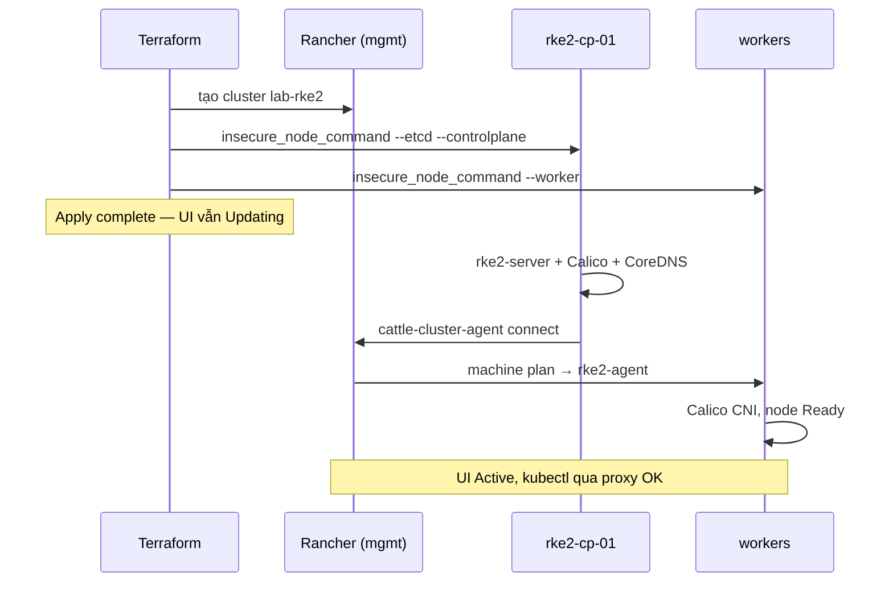

# Terraform lab: Rancher + RKE2 trên Proxmox

Lab Terraform: 4 VM Ubuntu 24.04 trên Proxmox (cloud-init **luôn DHCP**; ghim MAC rồi map IP trên DHCP/router), Rancher trên k3s single-node, custom cluster RKE2 (1 control-plane + 2 workers).

Proxmox dùng provider [`bpg/proxmox` v0.111.1](https://registry.terraform.io/providers/bpg/proxmox/0.111.1/docs) (pin `=`, không `~>`). Clone template, cloud-init native (không Snippets), chờ `qemu-guest-agent` lấy IPv4.

Thiết kế / quyết định kỹ thuật: [`PLAN.md`](PLAN.md).

## Lab đang chạy

Stack đã apply thành công (xem `terraform output` — IPv4 là lease DHCP, đổi nếu reservation chưa map MAC):

| VM | Vai trò | MAC (ghim) |
| --- | --- | --- |
| `rancher-mgmt` | k3s + Helm Rancher | `BC:24:11:00:00:10` |
| `rke2-cp-01` | etcd + control-plane | `BC:24:11:00:00:11` |
| `rke2-wk-01` | worker | `BC:24:11:00:00:12` |
| `rke2-wk-02` | worker | `BC:24:11:00:00:13` |

- Cluster Rancher: `lab-rke2`
- URL: `https://rancher.<mgmt_ip>.sslip.io` (`terraform output rancher_url`)
- Pin hiện tại: k3s `v1.36.3+k3s1`, RKE2 `v1.36.3+rke2r1`, Rancher chart `rancher-latest` (chưa pin version)
- Datastore lab: `rancher-data-thin`, bridge `vmbr0`, node `pve`

## Kiến trúc

```text
terraform
  ├─ clone ─ rancher-mgmt  (k3s + Helm Rancher)
  ├─ clone ─ rke2-cp-01    (join --etcd --controlplane)
  ├─ clone ─ rke2-wk-01    (join --worker)
  └─ clone ─ rke2-wk-02    (join --worker)
```

Downstream **không** tự cài RKE2. Rancher tạo cluster custom; Terraform SSH vào từng node và chạy `insecure_node_command`.

Tổng RAM mặc định ~20 GB: mgmt 4 vCPU / 8 GB / 40 GB; mỗi node RKE2 2 vCPU / 4 GB / 40 GB.

## Yêu cầu

- Proxmox VE với datastore (biến mặc định `local-lvm`; lab này dùng `rancher-data-thin`) và bridge (mặc định `vmbr0`)
- Terraform >= 1.8
- SSH key trên laptop (`ssh_public_key_path` / `ssh_private_key_path`)
- VM lab ra internet (Helm, k3s, image). sslip.io từ **laptop** cần DNS không chặn RFC1918
- Template Ubuntu 24.04 **có** `qemu-guest-agent` và **đã xóa** `machine-id` (script bên dưới)

## 1. API token Proxmox

Export trên laptop (không commit). `PROXMOX_VE_ENDPOINT` **phải có `/` cuối**, không thêm `/api2/json`:

```bash
export PROXMOX_VE_ENDPOINT="https://192.168.100.252:8006/"
export PROXMOX_VE_INSECURE="true"
```

Tạo token (SSH vào node Proxmox). Secret chỉ hiện một lần:

```bash
pveum user token add root@pam terraform --privsep=0
export PROXMOX_VE_API_TOKEN="root@pam!terraform=<value-uuid>"
```

Hoặc user riêng `terraform@pve` — privilege copy từ [Creating an API Token](https://registry.terraform.io/providers/bpg/proxmox/0.111.1/docs#creating-an-api-token-on-the-proxmox-server).

UI: **Datacenter → Permissions → API Tokens → Add**. Bỏ tick Privilege Separation.

Kiểm tra:

```bash
curl -k -H "Authorization: PVEAPIToken=${PROXMOX_VE_API_TOKEN}" \
  "${PROXMOX_VE_ENDPOINT}api2/json/version"
```

Phải thấy JSON, không 401. Lab không cần `PROXMOX_VE_SSH_*` (không upload Snippets).

## 2. Template Ubuntu 24.04

Chạy **trên node Proxmox** (một lần, hoặc **làm lại** nếu clone đang dùng chung một IPv4). Terraform không tạo template.

Không cài `libguestfs-tools` / `virt-customize` trên host PVE — conflict với `pve-qemu-kvm`. Script bake guest-agent bằng boot cloud-init một lần rồi `poweroff`. Host chỉ cần `wget`, `ca-certificates`, và `genisoimage` (script cài nếu thiếu).

Copy [`scripts/proxmox/`](scripts/proxmox/) lên node (`scripts/local` chạy trên laptop, không cần trên PVE):

```bash
ssh pve 'mkdir -p /root/rancher/scripts'
scp -r scripts/proxmox pve:/root/rancher/scripts/
```

```bash
cd rancher
sudo VMID=9000 STORAGE=rancher-data-thin BRIDGE=vmbr0 \
  ./scripts/proxmox/create-ubuntu-24.04-template.sh
```

Biến môi trường (mặc định trong ngoặc): `VMID` (9000), `VM_NAME` (`ubuntu-24.04-cloud`), `STORAGE` (`local-lvm`; lab này `rancher-data-thin`), `ISO_STORAGE` (`local` — seed cidata lúc bake), `BRIDGE` (`vmbr0`), `DISK_SIZE` (`40G`), `BAKE_TIMEOUT_SEC` (600). Guest cần DHCP + HTTPS ra ngoài trên `BRIDGE`. Nếu bake không `poweroff` đúng hạn: `qm terminal $VMID`.

Script tải cloud image, tạo VM, attach ISO cidata, boot một lần để cài `qemu-guest-agent`, passwordless sudo cho `ubuntu`, netplan `99-dhcp-mac.yaml` (`dhcp-identifier: mac`), xóa `machine-id` / SSH host key, `poweroff`. Sau đó gỡ ISO bake, gắn drive cloud-init của Proxmox (`ipconfig0 ip=dhcp`), `qm template`.

Đặt `template_id = 9000` trong `terraform.tfvars`.

## 3. Terraform

```bash
cp terraform.tfvars.example terraform.tfvars
# sửa proxmox_node, template_id, datastore_id, SSH paths, mật khẩu Rancher
```

`kubernetes_version` của RKE2 phải trùng version Rancher đang liệt kê (UI: Cluster Management → Create → Custom). Nếu apply lỗi version, sửa `rke2_kubernetes_version`.

Ghim MAC rồi map reservation trên DHCP/router:

```hcl
mgmt_mac_address    = "BC:24:11:00:00:10"
rke2_cp_mac_address = "BC:24:11:00:00:11"
rke2_worker_mac_addresses = [
  "BC:24:11:00:00:12",
  "BC:24:11:00:00:13",
]
```

```bash
terraform init
```

`rancher2` cần URL Rancher. URL lấy từ IPv4 DHCP sau khi guest-agent báo. Lần đầu nên apply 2 bước — [`scripts/local/install.sh`](scripts/local/install.sh) trên laptop, hoặc:

```bash
terraform apply -auto-approve \
  -target=module.mgmt \
  -target=module.rke2_control_plane \
  -target=module.rke2_workers && \
terraform apply -auto-approve
```

Lần sau (state đã có IP) thường `terraform apply` một lần là đủ.

**Apply complete chưa phải cluster Active.** Terraform chỉ clone VM, cài Rancher, rồi SSH chạy `insecure_node_command` (bật `rancher-system-agent`). RKE2, Calico, `cattle-cluster-agent`, và worker join chạy **sau đó**, vài phút. UI Rancher lúc này là **Updating**; `kubectl` qua kubeconfig Terraform (proxy Rancher) trả `ClusterUnavailable 503`; cột CPU / Memory / Pods là `--`.

Thứ tự sau `Apply complete!`:

1. Control-plane unpack RKE2, start `rke2-server` (etcd + apiserver). UI: *Waiting for Cluster control plane to be initialized, waiting for cluster agent to connect*.
2. Calico + CoreDNS lên trên CP. Chart khác (metrics-server, Traefik, …) **Pending**: node CP có taint `control-plane` / `etcd`, chưa có worker Ready.
3. `cattle-cluster-agent` resolve hostname Rancher (CoreDNS `hosts`) rồi nối Rancher → condition `Connected=True`.
4. Rancher gửi machine plan xuống worker. `rancher-system-agent` cài `rke2-agent`. Worker xuất hiện **NotReady**; Rancher: *configuring worker node(s)* / *waiting for probes: calico, kubelet*.
5. Calico `install-cni` xong trên worker → cả 3 node **Ready**. Helm chart còn Pending schedule được. Cluster `Ready` + `Updated` → UI **Active**. `kubectl get nodes` qua kubeconfig Rancher mới thành công.



## Outputs

- `rancher_url` — UI (`https://rancher.<ip>.sslip.io`)
- IP + MAC 4 VM
- `cluster_name` / `cluster_id`
- `rke2_kube_config` (sensitive; có thể trống đến khi cluster **Active** / Connected)

```bash
terraform output -raw rke2_kube_config > kubeconfig-rke2.yaml
export KUBECONFIG=$PWD/kubeconfig-rke2.yaml
kubectl get nodes
```

Nếu `503 ClusterUnavailable` / UI **Updating**: đợi bootstrap (mục trên), không phải apply lỗi.

Đăng nhập Rancher bằng user `admin` và `rancher_bootstrap_password`.

## Destroy / rebuild

```bash
terraform destroy
```

`destroy` xóa VM; object cluster trên Rancher mất theo VM mgmt.

Nếu VM còn trên Proxmox nhưng state lệch, copy [`scripts/proxmox/destroy-clones-from-template.sh`](scripts/proxmox/destroy-clones-from-template.sh) lên **node PVE**. Script **không** xóa template. Clone full không giữ field “cloned from VMID”, nên match theo (OR):

1. disk linked-clone `base-${TEMPLATE_ID}-`
2. tag Proxmox `TAG` (mặc định `rancher-lab` — Terraform gán `vm_tags`)
3. `NAME_REGEX` (mặc định `^(rancher-mgmt|rke2-cp-|rke2-wk-)`)

```bash
sudo DRY_RUN=1 ./scripts/proxmox/destroy-clones-from-template.sh
sudo FORCE=1 TEMPLATE_ID=9000 ./scripts/proxmox/destroy-clones-from-template.sh
```

`DRY_RUN=1` chỉ in bảng NODE / VMID / NAME / STATUS / REASON. Không có TTY thì bắt buộc `FORCE=1` (bỏ prompt `yes`). Sau đó `terraform destroy` trên laptop cho sạch state, rồi apply lại. Rebuild template nếu nghi `machine-id` bake sai:

```bash
sudo VMID=9000 STORAGE=rancher-data-thin BRIDGE=vmbr0 \
  ./scripts/proxmox/create-ubuntu-24.04-template.sh
```

## Provider Proxmox: vì sao `virtual_environment_vm`?

Dùng resource `proxmox_virtual_environment_vm` với block `clone` + `initialization` + `agent`, không dùng `proxmox_virtual_environment_cloned_vm`. Resource clone mới **không** quản lý cloud-init / guest-agent — lab này cần DHCP, SSH key, và IPv4 từ agent.

## Điểm dễ vướng

- Template **phải** có `qemu-guest-agent`. Không có thì clone treo khi chờ IP, `ipv4_addresses` rỗng.
- Template **phải** xóa `machine-id` trước khi `qm template`. Nếu không, mọi clone dùng chung DUID DHCP → cùng một IPv4, Terraform SSH nhầm VM (Rancher cài lên `rke2-cp-01`). Rebuild template rồi `terraform destroy` / `apply`. Ghim MAC rồi map reservation DHCP cũng tránh lệch lease.
- Token format: `user@realm!tokenid=uuid`.
- Mgmt 8 GB RAM; 4 GB dễ OOM khi cài Rancher.
- sslip.io từ **laptop** cần DNS cho phép RFC1918 (không chặn DNS rebind). Healthcheck trên VM ghi `/etc/hosts` vì guest thường resolve qua IPv6 và không có bản ghi A. Pod trong RKE2 (`cattle-cluster-agent`) dùng CoreDNS, không đọc `/etc/hosts` của node — script join ghi thêm `HelmChartConfig` `rke2-coredns` (plugin `hosts`) trên control-plane. Không có bước này cluster **kẹt** Updating với `waiting for probes: calico` / agent crash `Could not resolve host: rancher.<ip>.sslip.io`. Updating **vài phút ngay sau apply** là bình thường (bootstrap, mục Terraform).
- Join dùng `insecure_node_command` + `CATTLE_AGENT_STRICT_VERIFY=false` vì cert Rancher tự ký.
- Pin `k3s_version` cho khớp matrix Rancher. Latest k3s đôi khi quá mới. Rancher 2.15 hỗ trợ Kubernetes 1.34–1.36; `rancher-latest` không pin sẽ kéo 2.15. Script cài đặt dùng Helm 4.
- `rancher2_bootstrap` chờ condition `Updated` trên cluster `local` (timeout mặc định 120s; provider lab set `15m`). `/ping` lên sớm hơn, và Rancher 2.15 **không** set `Updated` cho local k3s — script cài đặt chờ Connected + webhook rồi giữ condition đó để provider không timeout.
- Không gán IPv4 tĩnh trong Terraform: file netplan `99-dhcp-mac.yaml` trên template ghi đè ipconfig static của Proxmox.

## TODO

Việc lab cốt lõi (VM + Rancher + join RKE2) đã xong. Phần dưới là hướng mở rộng, chưa làm.

- [ ] Pin `rancher_chart_version` trong `terraform.tfvars` (hiện để trống = latest) để rebuild tái lập được
- [ ] Đưa version cert-manager ra Terraform variable (đang hardcode `v1.21.1` trong script cài)
- [ ] Map DHCP reservation theo MAC trên router/DHCP server (lease hiện lấy từ guest-agent; chưa reservation thì IP có thể đổi)
- [ ] DNS nội bộ (Pi-hole / Unbound / record trên router) thay sslip.io + `/etc/hosts` + CoreDNS `hosts`
- [ ] TLS thật (Let's Encrypt hoặc CA lab) — bỏ `--insecure` / `CATTLE_AGENT_STRICT_VERIFY=false`
- [ ] Local-path (hoặc storage tương đương) trên cluster RKE2
- [ ] MetalLB hoặc kube-vip cho Service `LoadBalancer`
- [ ] Demo workload + Ingress trên RKE2
- [ ] HA RKE2: 3 control-plane (hiện 1 CP)
- [ ] HA Rancher (hiện 1 replica trên k3s single-node)
- [ ] VLAN / tách mạng mgmt và workload
- [ ] Bỏ workaround `rancher-ensure-updated-condition` khi `rancher2` hỗ trợ cluster local Rancher 2.15

## Việc không làm

- Node driver Proxmox (không official, kém ổn định hơn custom cluster)
- Gán IPv4 tĩnh trong Terraform (DHCP + MAC là hướng đã chốt)
